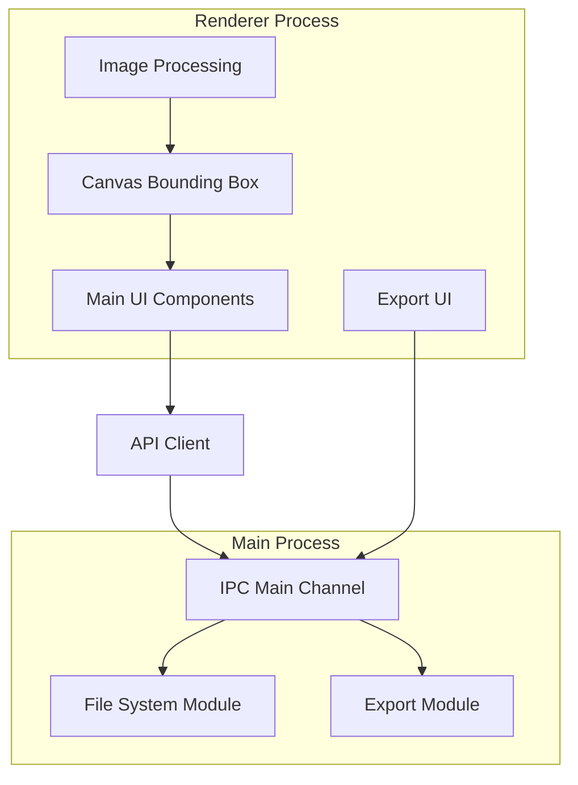
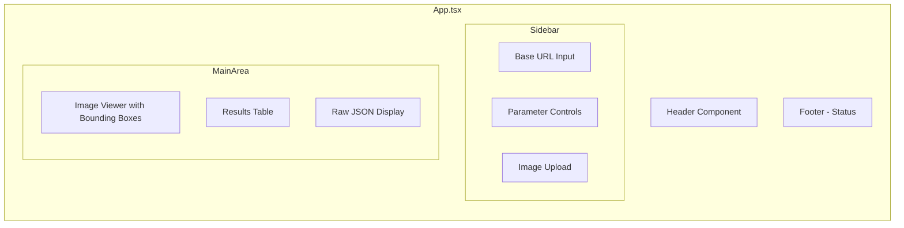
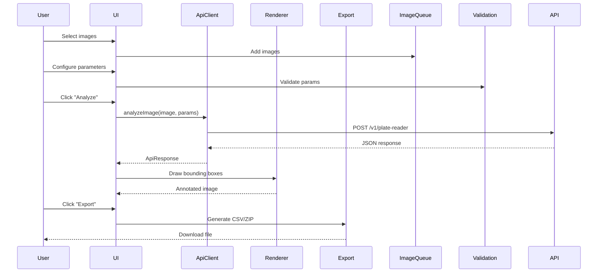
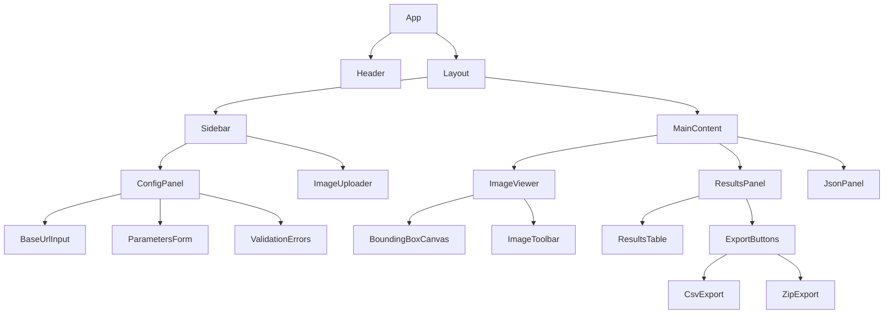

# PlateRecognizer Snapshot API Tester - Electron Application

## Executive Summary

This document outlines the architecture for an Electron desktop application that serves as a frontend for testing the PlateRecognizer Snapshot API. The application allows users to configure arbitrary API endpoints, upload images (single or multiple), visualize detection results with bounding boxes, and export results in various formats.

**Technology Stack:**
- Electron + Electron Forge (main application framework + build tooling)
- React 18 (UI library)
- TypeScript (type safety, strict mode)
- Webpack (build tool, via Electron Forge TypeScript + Webpack template)
- Material UI (MUI) (component library)
- Canvas API (bounding box rendering)
- React Refresh (HMR for development)

---

## PlateRecognizer Snapshot API Reference (Complete)

> Source: https://guides.platerecognizer.com/docs/snapshot/api-reference

### HTTP Request

```
POST https://api.platerecognizer.com/v1/plate-reader/
```

The CORS policy allows requests from all origins. For local SDK installations, the base URL is configurable (e.g., `http://localhost:8080/v1/plate-reader/`).

### Authentication

- **Header:** `Authorization: Token YOUR_API_TOKEN`
- **Required** for Snapshot Cloud (`api.platerecognizer.com`)
- **Optional** for local SDK installations

### POST Parameters

| Parameter | Required | Type | Description |
|-----------|----------|------|-------------|
| `upload` | Yes* | File (multipart/form-data) or base64 string | The image file to be uploaded. Becomes optional if `upload_url` is present. |
| `upload_url` | No | string (URL) | URL of the image to be uploaded. Alternative to `upload`. |
| `regions` | No | string[] (comma-separated or multiple -F) | Match license plate pattern of specific states or countries. Accepts multiple arguments or comma-separated values. See [list of states and countries](https://guides.platerecognizer.com/docs/other/countries). |
| `camera_id` | No | string | Unique camera identifier. |
| `timestamp` | No | string (ISO 8601) | ISO 8601 timestamp in UTC. Example: `2019-08-19T13:11:25`. |
| `mmc` | No | boolean (`true`/`false`) | Predict vehicle make, model, orientation, color, and year (since v1.58.0). Additional fee for cloud. |
| `direction` | No | boolean (`true`/`false`) | Predict vehicle direction of travel. Requires `mmc=true`. New in v1.52.0. |
| `config` | No | JSON string | Additional engine configuration. See Engine Configuration below. |

### Engine Configuration (`config` parameter)

The `config` parameter is a JSON string that modifies engine behavior. Multiple options can be combined.

| Config Key | Values | Description |
|------------|--------|-------------|
| `mode` | `"fast"` | Number of detection steps is always 1. ~30% speed-up. May reduce accuracy for small vehicles. |
| `mode` | `"redaction"` | Used for Plate Recognizer Blur. Includes more candidates, may increase false positives. |
| `detection_rule` | `"strict"` | License plates detected outside a vehicle will be discarded. |
| `detection_mode` | `"vehicle"` | Default is `"plate"` - only returns vehicles if a plate is found. `"vehicle"` returns vehicles even without plates. |
| `region` | `"strict"` | Only accept results that exactly match the templates of the specified region. A region must be specified. Not recommended for vanity plates. |
| `threshold_d` | float (0-1) | Detection confidence threshold (dscore). Example: `0.2` |
| `threshold_o` | float (0-1) | OCR/reading confidence threshold (score). Example: `0.6` |
| `text_formats` | string[] (regex patterns) | List of regular expressions to guide predictions. Example: `["[0-9][0-9][0-9][a-z][a-z]"]` |
| `plates_per_vehicle` | integer | Maximum number of license plates expected per vehicle. Default: 1. |
| `zoom_in_vehicles` | integer | Maximum number of vehicles Snapshot zooms on for plate recognition. Helps with high-res images. Default: 4. New in v1.47.0. |

**Config Examples:**
```bash
# Custom threshold and fast mode:
-F config='{"mode":"fast", "threshold_d":0.2, "threshold_o":0.6}'

# Strict region matching:
-F config='{"region":"strict"}' -F region=us-ca

# Detection rule strict (plates must be on vehicles):
-F config='{"detection_rule":"strict"}'
```

### API Response Shape: `detection_mode = plate` (default)

```typescript
interface SnapshotApiResponse {
  processing_time: number;        // Processing time in ms (e.g., 288.758)
  results: PlateResult[];         // Array of detected plates
  filename: string;               // Original filename (e.g., "1617_7M83K_car.jpg")
  version: number;                // API version (e.g., 1)
  camera_id: string | null;       // Camera ID if provided
  timestamp: string;              // ISO 8601 timestamp (e.g., "2020-10-12T16:17:27.574008Z")
}

interface PlateResult {
  // --- Always present ---
  box: BoundingBox;               // Plate bounding box coordinates
  plate: string;                  // Best plate text prediction (e.g., "nhk552")
  region: RegionInfo;             // Detected region
  vehicle: VehicleInfo;           // Vehicle detection info
  score: number;                  // OCR confidence (0-1). Close to 1 = high confidence.
  candidates: PlateCandidate[];   // Alternative plate predictions. First = same as plate.
  dscore: number;                 // Detection confidence (0-1). Close to 1 = high confidence.

  // --- Only when mmc=true ---
  model_make?: MakeModelEntry[];  // Vehicle make/model predictions
  color?: ColorEntry[];           // Vehicle color predictions
  orientation?: OrientationEntry[]; // Vehicle orientation predictions

  // --- Only when mmc=true AND direction=true ---
  direction?: number;             // Direction in degrees on Unit Circle (e.g., 134)
  direction_score?: number;       // Confidence for direction prediction (e.g., 0.76)
}

interface BoundingBox {
  xmin: number;                   // Top-left X coordinate in pixels
  ymin: number;                   // Top-left Y coordinate in pixels
  xmax: number;                   // Bottom-right X coordinate in pixels
  ymax: number;                   // Bottom-right Y coordinate in pixels
}

interface RegionInfo {
  code: string;                   // Region code from country list (e.g., "gb", "us-ca", "unknown")
  score: number;                  // Confidence for region prediction (0-1)
}

interface VehicleInfo {
  score: number;                  // Vehicle detection confidence (0-1). 0 if no vehicle found.
  type: string;                   // One of: "Big Truck", "Bus", "Motorcycle", "Pickup Truck", "Sedan", "SUV", "Van", "Unknown"
  box: BoundingBox;               // Vehicle bounding box. All zeros if no vehicle found.
}

interface PlateCandidate {
  score: number;                  // Confidence for this candidate (0-1)
  plate: string;                  // Plate text for this candidate
}

interface MakeModelEntry {
  make: string;                   // Vehicle make (e.g., "Riley", "Toyota", "Hyundai")
  model: string;                  // Vehicle model (e.g., "RMF", "Camry", "Santa Fe")
  score: number;                  // Confidence (0-1)
}

interface ColorEntry {
  color: string;                  // One of: "black", "blue", "brown", "green", "red", "silver", "white", "yellow", "unknown"
  score: number;                  // Confidence (0-1)
}

interface OrientationEntry {
  orientation: string;            // One of: "Front", "Rear", "Unknown"
  score: number;                  // Confidence (0-1)
}
```

### API Response Shape: `detection_mode = vehicle`

When `config={"detection_mode":"vehicle"}`, the response includes vehicles even without detected plates. The `results` array may contain entries where `plate` is empty.

### Response Notes

- **Scores** vary between 0 and 1. A score close to 1 indicates high confidence.
- **dscore** is the detection confidence. Use it to filter false positives (e.g., dscore > 0.3).
- **Vehicle box** coordinates are all 0 when no vehicle is found.
- **model_make**, **color**, **orientation** arrays are only present when `mmc=true`.
- **direction** and **direction_score** are only present when both `mmc=true` and `direction=true`.
- **year_range** and **year/score** are available with `mmc=true` (since v1.58.0).

---

## Phase 1 Scope (Current Critical Features)

### Core Requirements
1. **Arbitrary Base URL Support**
   - Configure any API endpoint (local SDK or cloud API)
   - Support for both authenticated and unauthenticated endpoints
   - Default: `https://api.platerecognizer.com/v1/plate-reader/`

2. **JSON Response Processing**
   - Parse full `SnapshotApiResponse` structure
   - Extract plate detections with confidence scores
   - Handle multiple detections per image
   - Handle both `detection_mode=plate` and `detection_mode=vehicle` responses

3. **Bounding Box Visualization**
   - Draw plate bounding boxes on images (from `results[].box`)
   - Draw vehicle bounding boxes on images (from `results[].vehicle.box`)
   - Display plate text and confidence scores
   - Handle different image sizes and aspect ratios

4. **Parameter Configuration (Phase 1 subset)**
   - `regions` - Country/Region codes (comma-separated)
   - `config.detection_rule` - `"strict"` or empty
   - `config.detection_mode` - `"plate"` (default) or `"vehicle"`
   - `config.threshold_d` - Detection confidence threshold (0-1)
   - `config.threshold_o` - OCR confidence threshold (0-1)
   - `config.mode` - `"fast"` or default
   - `mmc` - Enable make/model/color (boolean)
   - `config.region` - `"strict"` or empty

---

## Architecture Overview

### System Architecture



### Component Architecture



---

## Project Structure

```
SnapshotApiTester/
├── src/
│   ├── main.ts                     # Electron main process entry
│   ├── preload.ts                  # Preload script (context bridge)
│   ├── global.d.ts                 # Global type declarations (window.electronAPI)
│   ├── ipc/
│   │   ├── handlers.ts             # IPC handler registration
│   │   ├── export.ts               # Export handlers (CSV, ZIP)
│   │   └── file.ts                 # File system operations
│   ├── store/
│   │   └── settings.ts             # Persistent settings (electron-store)
│   └── renderer/
│       ├── index.html              # Main HTML template
│       ├── renderer.tsx            # React entry point
│       ├── App.tsx                 # Main application component
│       ├── styles/
│       │   └── App.css
│       ├── components/
│       │   ├── Header.tsx          # App header with status
│       │   ├── Sidebar.tsx         # Configuration sidebar
│       │   ├── Config/
│       │   │   ├── BaseUrlInput.tsx
│       │   │   ├── ParametersForm.tsx
│       │   │   └── Validation.tsx
│       │   ├── Image/
│       │   │   ├── ImageUploader.tsx
│       │   │   ├── ImageList.tsx
│       │   │   └── ImageViewer.tsx
│       │   ├── BoundingBox/
│       │   │   ├── BoundingBoxCanvas.tsx
│       │   │   └── BoundingBoxOverlay.tsx
│       │   ├── Results/
│       │   │   ├── ResultsTable.tsx
│       │   │   └── JsonViewer.tsx
│       │   └── Export/
│       │       ├── CsvExport.tsx
│       │       └── ZipExport.tsx
│       ├── hooks/
│       │   ├── useApi.ts           # API request hook
│       │   ├── useImageProcessing.ts
│       │   └── useExport.ts
│       ├── services/
│       │   ├── api.ts              # API client service
│       │   ├── boundingBox.ts      # Bounding box calculations
│       │   ├── csv.ts              # CSV generation
│       │   └── zip.ts              # ZIP creation
│       ├── types/
│       │   ├── api.ts              # API response/request types
│       │   └── export.ts           # Export types
│       └── utils/
│           ├── validation.ts       # Parameter validation
│           └── formatters.ts       # Data formatters
├── assets/
│   └── icon.png                    # App icon
├── package.json
├── forge.config.ts                 # Electron Forge configuration
├── tsconfig.json
├── webpack.main.config.ts          # Webpack config for main process
├── webpack.renderer.config.ts      # Webpack config for renderer
├── webpack.plugins.ts              # Webpack plugins (React Refresh, etc.)
└── webpack.rules.ts                # Webpack loaders
```

---

## Key Components Detailed Design

### 1. API Client Service (`src/services/api.ts`)

**Responsibilities:**
- Make HTTP requests to arbitrary endpoints
- Handle multipart form data for image uploads
- Support optional authentication headers
- Transform API responses into internal types

**Interface:**
```typescript
interface ApiClient {
    baseUrl: string;             // Arbitrary endpoint URL
    token?: string;              // Optional API token (required for cloud, optional for SDK)
    
    analyzeImage(
        image: File,
        params: ApiParameters
    ): Promise<SnapshotApiResponse>;
    
    testConnection(): Promise<boolean>;
}

// POST form-data parameters (matches API reference above)
interface ApiParameters {
    upload?: File;                // Image file (multipart/form-data or base64)
    upload_url?: string;          // URL of image (alternative to upload)
    regions?: string[];           // Country/region codes (e.g., ["us", "us-ca", "mx"])
    camera_id?: string;           // Unique camera identifier
    timestamp?: string;           // ISO 8601 timestamp in UTC
    mmc?: boolean;                // Enable make/model/color/orientation/year
    direction?: boolean;          // Enable direction prediction (requires mmc=true)
    config?: EngineConfig;        // Engine configuration (sent as JSON string)
}

// Engine configuration (serialized as JSON string in the config field)
interface EngineConfig {
    mode?: 'fast' | 'redaction';           // Detection speed mode
    detection_rule?: 'strict';             // Discard plates outside vehicles
    detection_mode?: 'plate' | 'vehicle';  // Default: plate
    region?: 'strict';                     // Only accept exact region template matches
    threshold_d?: number;                  // Detection confidence threshold (0-1)
    threshold_o?: number;                  // OCR confidence threshold (0-1)
    text_formats?: string[];               // Regex patterns to guide predictions
    plates_per_vehicle?: number;           // Max plates per vehicle (default: 1)
    zoom_in_vehicles?: number;             // Max vehicles to zoom on (default: 4)
}

// Response types reference the full SnapshotApiResponse defined
// in the API Reference section above
```

### 2. Parameter Validation (`src/utils/validation.ts`)

**Validation Rules (aligned with API reference):**
```typescript
const validationSchema = {
    // --- Connection Settings ---
    baseUrl: {
        type: 'url',
        required: true,
        pattern: /^https?:\/\/.+/,
        default: 'https://api.platerecognizer.com/v1/plate-reader/',
        message: 'Must be a valid HTTP/HTTPS URL'
    },
    token: {
        type: 'string',
        required: false,  // Optional for local SDK
        message: 'API token (required for cloud API)'
    },

    // --- POST Parameters ---
    regions: {
        type: 'array',
        required: false,
        items: {
            type: 'string',
            pattern: /^[a-z]{2}(-[a-z0-9]{2,4})?$/,
            message: 'Invalid region code format (e.g., "us", "us-ca", "mx")'
        },
        message: 'Comma-separated region codes'
    },
    camera_id: {
        type: 'string',
        required: false,
        message: 'Unique camera identifier'
    },
    timestamp: {
        type: 'string',
        required: false,
        pattern: /^\d{4}-\d{2}-\d{2}T\d{2}:\d{2}:\d{2}/,
        message: 'Must be ISO 8601 format (e.g., 2019-08-19T13:11:25)'
    },
    mmc: {
        type: 'boolean',
        required: false,
        default: false,
        message: 'Enable make/model/color prediction'
    },
    direction: {
        type: 'boolean',
        required: false,
        default: false,
        dependsOn: { mmc: true },  // Only valid when mmc=true
        message: 'Enable direction prediction (requires mmc=true)'
    },

    // --- Engine Config Parameters ---
    'config.mode': {
        type: 'enum',
        required: false,
        values: ['fast', 'redaction'],
        message: 'fast = 30% speed-up, redaction = more candidates'
    },
    'config.detection_rule': {
        type: 'enum',
        required: false,
        values: ['strict'],
        message: 'strict = discard plates detected outside vehicles'
    },
    'config.detection_mode': {
        type: 'enum',
        required: false,
        values: ['plate', 'vehicle'],
        default: 'plate',
        message: 'plate = default, vehicle = return vehicles without plates'
    },
    'config.region': {
        type: 'enum',
        required: false,
        values: ['strict'],
        dependsOn: { regions: 'non-empty' },  // Region must be specified
        message: 'strict = only accept exact region template matches'
    },
    'config.threshold_d': {
        type: 'number',
        required: false,
        min: 0,
        max: 1,
        message: 'Detection confidence threshold (0-1)'
    },
    'config.threshold_o': {
        type: 'number',
        required: false,
        min: 0,
        max: 1,
        message: 'OCR/reading confidence threshold (0-1)'
    },
    'config.text_formats': {
        type: 'array',
        required: false,
        items: { type: 'string' },
        message: 'Regex patterns to guide predictions'
    },
    'config.plates_per_vehicle': {
        type: 'integer',
        required: false,
        min: 1,
        default: 1,
        message: 'Max plates per vehicle'
    },
    'config.zoom_in_vehicles': {
        type: 'integer',
        required: false,
        min: 1,
        default: 4,
        message: 'Max vehicles to zoom on for recognition'
    }
};
```

### 3. Bounding Box Rendering (`src/components/BoundingBox/`)

**Canvas-based rendering approach:**
```typescript
interface BoundingBoxRenderer {
    canvas: HTMLCanvasElement;
    image: HTMLImageElement;
    boxes: BoundingBox[];
    scale: number;
    
    draw(): void;
    clear(): void;
    getScale(): number;
    calculateBoxPosition(box: BoundingBox): BoxPosition;
}

interface BoxPosition {
    x: number;
    y: number;
    width: number;
    height: number;
}

// Rendering features:
// - Color-coded boxes based on confidence score
// - Plate text overlay
// - Confidence score display
// - Hover tooltips for details
// - Zoom/pan support for large images
```

### 4. Image Management (`src/components/Image/`)

**Multi-image handling:**
```typescript
interface ImageQueue {
    images: ImageItem[];
    currentIndex: number;
    
    addImages(files: FileList): Promise<void>;
    removeImage(index: number): void;
    setCurrentImage(index: number): void;
    clear(): void;
}

interface ImageItem {
    id: string;
    file: File;
    preview: string;
    status: 'pending' | 'processing' | 'complete' | 'error';
    response?: ApiResponse;
    error?: string;
}
```

### 5. Export Services

**CSV Export (`src/services/csv.ts`):**
```typescript
interface CsvExport {
    generate(results: ApiResponse[], imageName: string): string;
    download(content: string, filename: string): void;
}

const CSV_COLUMNS = [
    'timestamp',
    'plate',
    'score',
    'dscore',
    'file',
    'box',
    'model_make',
    'color',
    'vehicle',
    'region',
    'orientation',
    'candidates',
    'source_url',
    'position_sec',
    'direction'
];
```

**ZIP Export (`src/services/zip.ts`):**
```typescript
interface ZipExport {
    addFile(path: string, content: string | Blob): void;
    addDirectory(path: string): void;
    generate(): Promise<Blob>;
    download(blob: Blob, filename: string): void;
}

// ZIP contents:
// - results.csv (combined CSV of all results)
// - images/ (copy of uploaded images)
// - json/ (individual JSON response files per image)
```

---

## Data Flow

### Image Analysis Flow



---

## UI Design

### Main Layout

```
┌─────────────────────────────────────────────────────────┐
│ [Logo] PlateRecognizer API Tester              [Status] │
├──────────────┬──────────────────────────────────────────┤
│              │                                          │
│  CONFIG      │  IMAGE VIEWER                           │
│  ──────      │  ┌────────────────────────────────────┐  │
│              │  │                                    │  │
│  Base URL:   │  │    [Image with Bounding Boxes]    │  │
│  [________]  │  │                                    │  │
│              │  │                                    │  │
│  Parameters  │  │                                    │  │
│  ──────────  │  └────────────────────────────────────┘  │
│              │                                          │
│  Regions:    │  RESULTS TABLE                          │
│  [us, us-ca] │  ┌────────────────────────────────────┐  │
│              │  │ Plate    Score   Box              │  │
│  Mode:       │  │ ABC123   0.95    [x,y,w,h]        │  │
│  [strict v]  │  │ XYZ789   0.87    [x,y,w,h]        │  │
│              │  └────────────────────────────────────┘  │
│  Threshold:  │                                          │
│  [0.50___]   │  JSON RESPONSE                          │
│              │  ┌────────────────────────────────────┐  │
│  Upload:     │  │ { "results": [...] }               │  │
│  [📁 Choose] │  └────────────────────────────────────┘  │
│              │                                          │
│  [Analyze]   │                                          │
│  [Export v]  │                                          │
│              │                                          │
└──────────────┴──────────────────────────────────────────┘
```

### Component Hierarchy



---

## Implementation Steps

### Step 1: Project Setup
1. Initialize Electron + React + TypeScript project with Electron Forge (`npx create-electron-app --template=typescript-webpack`)
2. Install React 18, MUI, and configure React Refresh for HMR
3. Set up secure IPC communication (contextIsolation=true, sandbox=true, nodeIntegration=false)
4. Configure preload script with type-safe context bridge
5. Set up global type declarations for `window.electronAPI`

### Step 2: Core Components
1. Create BaseUrlInput with URL validation
2. Implement ParametersForm with validation schema
3. Build ImageUploader for drag-and-drop support
4. Create ImageViewer with canvas rendering

### Step 3: API Integration
1. Implement ApiClient service
2. Create API request hooks
3. Handle response parsing and error states
4. Implement connection testing

### Step 4: Bounding Box Rendering
1. Create BoundingBoxCanvas component
2. Implement coordinate transformation
3. Add styling based on confidence scores
4. Implement hover tooltips

### Step 5: Export Functionality
1. Implement CSV generation
2. Create ZIP export with file structure
3. Add download handlers
4. Implement batch export for multiple images

### Step 6: Polish and Testing
1. Add loading states and progress indicators
2. Implement error handling and user feedback
3. Add keyboard shortcuts
4. Test with various image formats

---

## Future Enhancements (Post-Phase 1)

- **Batch Processing:** Process multiple images in queue
- **Result Filtering:** Filter by confidence, region, etc.
- **History:** Save and reload previous sessions
- **Comparison:** Side-by-side comparison of results
- **Custom Annotations:** Add manual bounding boxes
- **Plugin System:** Support for additional export formats
- **Remote Configuration:** Load settings from config file
- **Dark Mode:** UI theme support

---

## Dependencies

### Core Dependencies
```
react react-dom                          # React 18
@mui/material @emotion/react @emotion/styled  # Material UI
@mui/icons-material                      # MUI icons
react-dropzone                           # Drag-and-drop file upload
electron-store                           # Persistent settings storage
archiver                                 # ZIP creation (main process)
papaparse                                # CSV generation
```

### Development Dependencies
```
electron                                 # Electron runtime
@electron-forge/cli                      # Forge CLI
@electron-forge/maker-squirrel           # Windows installer
@electron-forge/maker-zip                # ZIP distribution
@electron-forge/maker-deb                # Linux .deb
@electron-forge/plugin-webpack           # Webpack integration
@electron-forge/plugin-auto-unpack-natives
typescript                               # TypeScript compiler
@types/react @types/react-dom            # React type definitions
@pmmmwh/react-refresh-webpack-plugin     # React HMR
react-refresh                            # React Refresh runtime
ts-loader css-loader style-loader        # Webpack loaders
eslint prettier                          # Code quality
```

---

## Validation Checklist

### Functionality
- [ ] Arbitrary base URL configuration
- [ ] URL validation
- [ ] Token optional for local SDK
- [ ] Image upload (single and multiple)
- [ ] Parameter validation
- [ ] API request execution
- [ ] JSON response parsing
- [ ] Bounding box extraction
- [ ] Canvas rendering
- [ ] CSV export matching sample format
- [ ] ZIP export with proper structure
- [ ] JSON response saving

### UI/UX
- [ ] Clean, intuitive layout
- [ ] Drag-and-drop image upload
- [ ] Real-time validation feedback
- [ ] Loading states
- [ ] Error messages
- [ ] Export status notifications
- [ ] Responsive design

### Code Quality
- [ ] TypeScript strict mode
- [ ] Component isolation
- [ ] Error boundaries
- [ ] Performance optimization
- [ ] Security considerations (IPC validation)

---

## Risk Assessment

| Risk | Impact | Mitigation |
|------|--------|------------|
| API changes | Medium | Abstract API client for easy updates |
| Large image handling | Medium | Implement image scaling and lazy loading |
| Cross-platform issues | Low | Test on Windows, macOS, Linux |
| Performance with many images | Medium | Implement pagination and queue system |

---

## Success Criteria

1. **Core Functionality:** Successfully sends images to arbitrary API endpoint and receives valid responses
2. **Visualization:** Accurately draws bounding boxes on images with correct coordinates
3. **Export:** Generates CSV files matching the provided sample format
4. **User Experience:** Intuitive UI with clear feedback and error handling
5. **Code Quality:** Well-structured, type-safe codebase following React best practices

---

## References

- [PlateRecognizer Snapshot API Documentation](https://guides.platerecognizer.com/docs/snapshot/api-reference)
- [Electron Documentation](https://www.electronjs.org/docs)
- [React Documentation](https://react.dev)
- [TypeScript Documentation](https://www.typescriptlang.org/docs)
